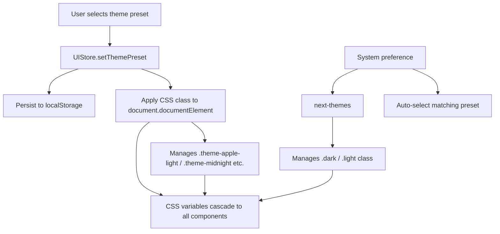

# Design: Theme System Refactoring

## Overview

本设计将小西瓜的主题系统从当前的「双主题（亮/暗）+ 硬编码颜色」架构升级为「多预设主题 + 全语义化 CSS 变量 + Apple 原生视觉风格」。

核心设计决策：
- **保留 `next-themes` 作为亮暗模式底层**，在其上层构建多预设系统
- **用 Zustand 管理 theme preset 选择**，用 CSS class 注入 preset 变量
- **所有颜色统一走 CSS custom properties**，消除组件中的硬编码颜色
- **新增毛玻璃效果类**，通过 Tailwind 工具类提供

## Architecture



### Theme Resolution Strategy

主题由两个维度决定：

1. **Color Mode** (亮/暗) — 由 `next-themes` 管理，基于 `.dark` / `.light` class
2. **Theme Preset** (预设) — 由新增的 preset 系统管理，基于 `.theme-{name}` class

每个 preset 定义两套色值（light 和 dark），CSS 变量根据 color mode + preset 组合解析：

```css
/* Default (Apple) preset - light */
:root, .theme-apple { --primary: oklch(...); }
/* Default (Apple) preset - dark */
.dark.theme-apple, .dark:root { --primary: oklch(...); }
/* Midnight preset - always dark-based */
.theme-midnight { --primary: oklch(...); }
```

## Components and Interfaces

### 1. Theme Preset Definition (`src/mainview/theme/presets.ts`)

```typescript
export interface ThemePreset {
  id: string           // e.g. 'apple', 'pastel', 'midnight', 'rose'
  nameKey: string      // i18n key for display name
  colorMode: 'light' | 'dark' | 'both'  // which mode(s) this preset supports
  cssClass: string     // e.g. 'theme-apple'
  preview: {           // for UI color swatches
    primary: string
    background: string
    accent: string
  }
}

export const themePresets: ThemePreset[] = [
  { id: 'apple-light', nameKey: 'theme.appleLight', colorMode: 'light', cssClass: 'theme-apple', preview: { ... } },
  { id: 'apple-dark', nameKey: 'theme.appleDark', colorMode: 'dark', cssClass: 'theme-apple', preview: { ... } },
  { id: 'pastel', nameKey: 'theme.pastel', colorMode: 'light', cssClass: 'theme-pastel', preview: { ... } },
  { id: 'midnight', nameKey: 'theme.midnight', colorMode: 'dark', cssClass: 'theme-midnight', preview: { ... } },
]
```

### 2. UIStore Extension (`stores/ui-store.ts`)

在现有 Zustand store 中新增：

```typescript
interface UIState {
  // ... existing
  themePreset: string  // preset id, e.g. 'apple-light'
}

interface UIActions {
  // ... existing
  setThemePreset: (presetId: string) => void
}
```

`setThemePreset` action 会：
1. 更新 store 中的 `themePreset`
2. 更新 `document.documentElement` 上的 CSS class
3. 调用 `next-themes` 的 `setTheme()` 设置对应的 color mode

### 3. ThemeProvider Enhancement (`components/ThemeProvider.tsx`)

```typescript
// 增强现有 ThemeProvider，增加 preset 初始化逻辑
export function ThemeProvider({ children }: { children: React.ReactNode }) {
  // 启动时恢复 preset class
  useEffect(() => {
    const preset = useUIStore.getState().themePreset
    applyPresetClass(preset)
  }, [])

  return (
    <NextThemesProvider attribute="class" defaultTheme="system" enableSystem>
      {children}
    </NextThemesProvider>
  )
}
```

### 4. Theme Selector Component (`components/ThemeSelector.tsx`)

替代侧边栏底部现有的亮/暗/系统下拉菜单，提供：
- 4 个预设色块 + "跟随系统" 选项
- 每个色块显示 3 色预览（primary + background + accent）
- 当前选中项显示勾选标记
- 使用 Popover 而非 DropdownMenu，更适合放色彩预览

### 5. CSS Variable Architecture (`index.css`)

#### 新增语义化 Token

在现有 shadcn tokens 基础上扩展：

```css
@theme inline {
  /* Existing shadcn tokens... */

  /* Priority colors */
  --color-priority-high: var(--priority-high);
  --color-priority-medium: var(--priority-medium);
  --color-priority-low: var(--priority-low);

  /* Status colors */
  --color-status-success: var(--status-success);
  --color-status-warning: var(--status-warning);
  --color-status-error: var(--status-error);

  /* Animation durations */
  --duration-fast: 100ms;
  --duration-normal: 200ms;
  --duration-slow: 300ms;
}
```

#### Apple Light Preset

```css
:root, .theme-apple {
  --background: oklch(0.985 0.002 250);      /* Cool white, slight blue */
  --foreground: oklch(0.14 0.005 260);       /* Near-black, cool */
  --primary: oklch(0.585 0.22 260);          /* Apple system blue #007AFF */
  --sidebar: oklch(0.96 0.005 250 / 0.8);   /* Semi-transparent for vibrancy */
  /* ... full token set ... */

  --priority-high: oklch(0.58 0.22 25);      /* System red */
  --priority-medium: oklch(0.75 0.18 75);    /* System orange */
  --priority-low: oklch(0.585 0.22 260);     /* System blue */

  --status-success: oklch(0.62 0.19 145);    /* System green */
  --status-warning: oklch(0.75 0.18 75);     /* System orange */
  --status-error: oklch(0.58 0.22 25);       /* System red */
}
```

#### Apple Dark Preset

```css
.dark.theme-apple, .dark:not([class*="theme-"]) {
  --background: oklch(0.16 0.005 260);       /* Elevated dark, not pure black */
  --card: oklch(0.20 0.005 260);             /* Elevated surface */
  --primary: oklch(0.62 0.22 260);           /* Bright blue on dark */
  --sidebar: oklch(0.18 0.005 260 / 0.85);  /* Semi-transparent dark */
  /* ... full token set ... */
}
```

#### Pastel (柔和马卡龙) Preset

```css
.theme-pastel {
  --background: oklch(0.985 0.01 330);       /* Warm cream with slight pink */
  --primary: oklch(0.68 0.15 330);           /* Soft rose */
  --accent: oklch(0.92 0.04 200);            /* Soft mint */
  /* ... */
}
```

#### Midnight (深邃午夜) Preset

```css
.theme-midnight {
  --background: oklch(0.10 0.02 275);        /* Deep navy */
  --primary: oklch(0.70 0.15 275);           /* Electric indigo */
  --card: oklch(0.14 0.015 275);             /* Elevated navy */
  /* ... */
}
```

## Data Models

### Theme Preset Configuration

无需后端数据模型变更。主题完全是前端概念：

```typescript
// src/mainview/theme/presets.ts
export interface ThemePreset {
  id: string
  nameKey: string
  colorMode: 'light' | 'dark' | 'both'
  cssClass: string
  preview: {
    primary: string    // hex for CSS preview swatch
    background: string
    accent: string
  }
}

// Required color tokens every preset must define
export const REQUIRED_TOKENS = [
  'background', 'foreground', 'card', 'card-foreground',
  'popover', 'popover-foreground', 'primary', 'primary-foreground',
  'secondary', 'secondary-foreground', 'muted', 'muted-foreground',
  'accent', 'accent-foreground', 'destructive', 'destructive-foreground',
  'border', 'input', 'ring',
  'chart-1', 'chart-2', 'chart-3', 'chart-4', 'chart-5',
  'sidebar', 'sidebar-foreground', 'sidebar-primary',
  'sidebar-primary-foreground', 'sidebar-accent',
  'sidebar-accent-foreground', 'sidebar-border', 'sidebar-ring',
  'priority-high', 'priority-medium', 'priority-low',
  'status-success', 'status-warning', 'status-error',
] as const
```

### UIStore Persistence Update

```typescript
// Extend partialize to include themePreset
partialize: (state) => ({
  compactMode: state.compactMode,
  language: state.language,
  themePreset: state.themePreset,  // NEW
})
```

## Correctness Properties

*A property is a characteristic or behavior that should hold true across all valid executions of a system — essentially, a formal statement about what the system should do. Properties serve as the bridge between human-readable specifications and machine-verifiable correctness guarantees.*

### Prework Analysis

**Acceptance Criteria Testing Prework:**

1.1 THE Theme_System SHALL provide at least four Theme_Presets
- Thoughts: We can verify that the exported `themePresets` array has length >= 4. More importantly, for all presets, they should have all required fields defined. This is a property over the set of presets.
- Testable: yes - property

1.3 WHEN a user selects a Theme_Preset, THE Theme_System SHALL persist the selection to localStorage
- Thoughts: For any valid preset id, calling `setThemePreset(id)` should result in localStorage containing that id. This is testable as a property.
- Testable: yes - property

1.4 WHEN the application starts, THE Theme_System SHALL restore the previously selected Theme_Preset
- Thoughts: This is the read side of persistence. Combined with 1.3 it forms a round-trip property: store → read → should match.
- Testable: yes - property (round-trip with 1.3)

2.1 THE Theme_System SHALL define Color_Tokens using oklch color space
- Thoughts: For all presets, for all required tokens, the computed CSS value should be valid oklch. Property over presets × tokens.
- Testable: yes - property

2.4 THE Theme_System SHALL define Semantic_Colors for specific categories
- Thoughts: For all presets, each required semantic token should be defined (non-empty). This is subsumed by the "all tokens valid" property.
- Testable: yes - property (redundant with 2.1 when combined)

2.5 Color contrast ratios SHALL meet WCAG AA
- Thoughts: For any preset, the foreground/background pair should have contrast >= 4.5:1. We need an oklch → relative luminance converter. Testable as property.
- Testable: yes - property

4.2-4.4 Define Color_Tokens for priority/chart/status
- Thoughts: Same as 2.4 — for all presets, these tokens should exist and be valid oklch.
- Testable: yes - property (redundant with combined token property)

**Property Reflection:**
- 1.1 (at least 4 presets) is subsumed by the "all tokens defined" check — if all tokens are valid for all presets and we check the presets array, it covers the count requirement.
- 1.3 + 1.4 combine into a single round-trip property.
- 2.1 + 2.4 + 4.2-4.4 combine into a single "all presets have all required tokens in valid oklch" property.
- 2.5 (contrast) is unique and standalone.

### Properties

**Property 1: Theme preset persistence round-trip**

*For any* valid theme preset id from the `themePresets` array, setting that preset via `setThemePreset()` and then reading the persisted value from localStorage should yield the same preset id.

**Validates: Requirements 1.3, 1.4**

**Property 2: All presets define all required tokens**

*For any* theme preset in the `themePresets` array, and *for any* token name in `REQUIRED_TOKENS`, the preset's CSS class, when applied to a document, should result in a non-empty computed value for the corresponding CSS custom property `--{token}`.

**Validates: Requirements 1.1, 2.1, 2.4, 4.2, 4.3, 4.4**

**Property 3: Text/background contrast meets WCAG AA**

*For any* theme preset, the computed `--foreground` and `--background` color pair should have a contrast ratio of at least 4.5:1 when converted from oklch to relative luminance.

**Validates: Requirements 2.5**

## Error Handling

| Scenario | Handling |
|----------|----------|
| Invalid preset id in localStorage | Fall back to `'apple-light'` default preset |
| Missing CSS custom property | Components use Tailwind semantic classes which have built-in fallbacks |
| `prefers-reduced-motion` active | All animation durations set to 1ms via media query |
| `prefers-reduced-transparency` active | Vibrancy effects disabled, solid backgrounds used |
| Preset CSS class missing from stylesheet | Variables fall back to `:root` defaults (Apple Light) |

## Testing Strategy

### Property-Based Testing (fast-check)

使用 `fast-check` 库进行属性测试，每个属性最少 100 次迭代。

- **Property 1**: 使用 `fc.constantFrom(...presetIds)` 生成随机 preset id，模拟 localStorage 写入/读取
- **Property 2**: 遍历所有 presets × REQUIRED_TOKENS，注入 CSS class 到 jsdom 后检查 computed style
- **Property 3**: 将 oklch 解析为 L/C/H 三元组，计算相对亮度和对比度

Tag format: `Feature: theme-system-refactoring, Property {N}: {text}`

### Unit Tests

- 特定 preset 的色值示例验证（Apple Light primary 应为系统蓝色区间）
- `applyPresetClass()` 函数正确管理 document.documentElement 的 class
- ThemeSelector 组件渲染所有 presets
- `getPriorityColor()` 等工具函数返回 CSS 变量引用而非硬编码值

### Test Library

- 前端: **Vitest** + **fast-check** (已在项目中)
- 测试文件位置: `src/mainview/theme/__tests__/`

### 关键文件清单

| 文件 | 作用 |
|------|------|
| [`src/mainview/index.css`](src/mainview/index.css) | CSS 变量定义，所有 preset 色值 |
| [`src/mainview/theme/presets.ts`](src/mainview/theme/presets.ts) | 新文件：preset 定义和常量 |
| [`src/mainview/theme/apply.ts`](src/mainview/theme/apply.ts) | 新文件：preset class 应用逻辑 |
| [`src/mainview/components/ThemeProvider.tsx`](src/mainview/components/ThemeProvider.tsx) | 增强：加入 preset 初始化 |
| [`src/mainview/components/ThemeSelector.tsx`](src/mainview/components/ThemeSelector.tsx) | 新文件：主题选择器组件 |
| [`src/mainview/stores/ui-store.ts`](src/mainview/stores/ui-store.ts) | 扩展：新增 themePreset 状态 |
| [`src/mainview/utils/priority.ts`](src/mainview/utils/priority.ts) | 重构：硬编码颜色 → CSS 变量 |
| [`src/mainview/components/Statistics.tsx`](src/mainview/components/Statistics.tsx) | 重构：图表颜色 → CSS 变量 |
| [`src/mainview/components/AppSidebar.tsx`](src/mainview/components/AppSidebar.tsx) | 重构：替换 theme 下拉为 ThemeSelector |

